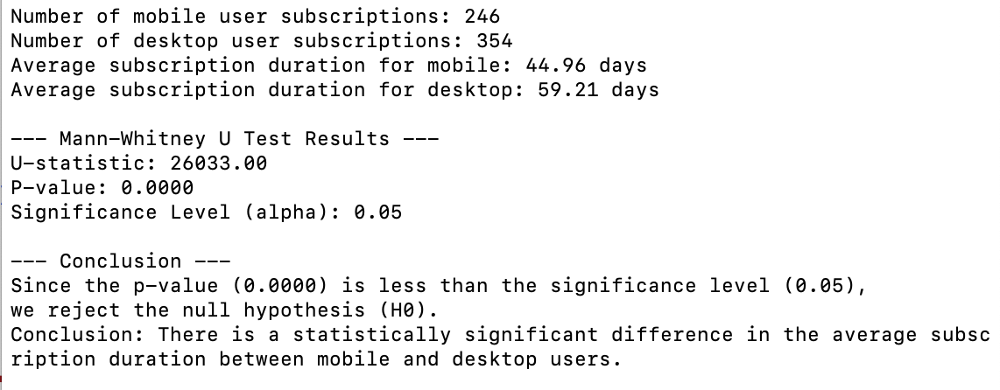
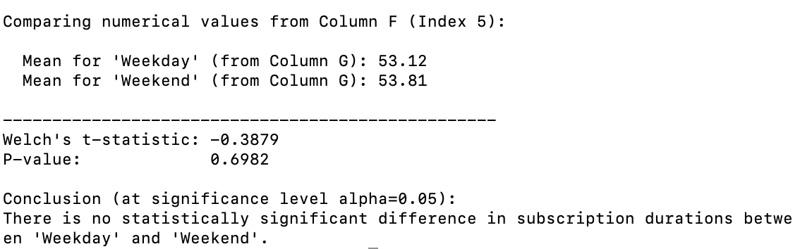
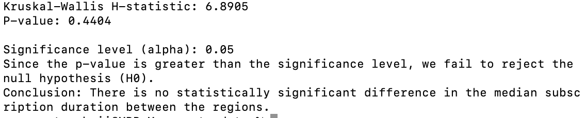

# 🧪 A/B Test Analysis

This project presents a comprehensive A/B testing analysis conducted using **Python scripts** to uncover key factors influencing user subscription duration in a given dataset. The primary objective was to identify statistically significant differences in user subscription durations across various user segments. The analysis focuses on understanding how user characteristics such as device `category` (mobile vs. desktop), `subscription_start_day` (weekday vs. weekend), and geographical `region` impact the length of user subscriptions. Testing specific hypotheses, this project aims to provide data-driven recommendations for improving overall subscription longevity.

---

## 📊 Analysis & Results

The project is divided into three sub-tasks, each addressing a specific comparison:

### Sub-task 1: Comparison of Subscription Duration by Device Category (Mobile vs. Desktop)

**Hypotheses:**
* $\text{H}_0$: There is no statistically significant difference in the average subscription duration between mobile and desktop users.
* $\text{H}_1$: There is a statistically significant difference in the average subscription duration between mobile and desktop users.

**Test Type:**

The **Mann-Whitney U test** was selected for this comparison as a non-parametric test, suitable for comparing two independent samples without assuming normality of the data. It is robust to outliers and non-normal distributions often found in real-world user data.

**Test Results:**



* Point estimate of Median Difference (Desktop - Mobile): $14.50$ days
* Bootstrapped $95\%$ Confidence Interval for Median Difference: $[10.0, 19.0]$ days

**Conclusion:**

Since the p-value ($0.000$) is less than the typical significance level of $0.05$, **we reject the null hypothesis ($\text{H}_0$)**. This indicates that there is a statistically significant difference in the average subscription duration between mobile and desktop users. Specifically, **desktop users have a notably longer average subscription duration compared to mobile users**, with a median difference estimated at $14.5$ days.

---

### Sub-task 2: Comparison of Subscription Duration by Subscription Start Date (Weekday vs. Weekend)

**Hypotheses:**
* $\text{H}_0$: There is no statistically significant difference in the average subscription duration between users who subscribed on a weekday and users who subscribed on a weekend.
* $\text{H}_1$: There is a statistically significant difference in the average subscription duration between users who subscribed on a weekday and users who subscribed on a weekend.

**Test Type:**

**Welch's t-test** was selected for this task because it's designed to handle situations where the variability between the two groups might not be the same, ensuring a more reliable comparison.

**Test Results:**



**Conclusion:**

With a p-value of $0.6982$, which is greater than the significance level of $0.05$, **we fail to reject the null hypothesis ($\text{H}_0$)**. This means that **there is no statistically significant difference** in the average subscription duration between users who subscribe on weekdays and those who subscribe on weekends.

---

### Sub-task 3: Comparison of Subscription Duration by Region

**Hypotheses:**
* $\text{H}_0$: The region of the user does not have a significant effect on the subscription duration.
* $\text{H}_1$: At least one region has a significantly different mean subscription duration compared to others.

**Test Type:**

Due to violations of both the normality assumption (in some key regions) and, more critically, the homogeneity of variances assumption, the traditional ANOVA test was deemed inappropriate. The **Kruskal-Wallis test** was chosen as an alternative. This non-parametric test does not assume normality or homogeneity of variances and is suitable for comparing three or more independent groups to determine if their population medians are equal.

**Test Results:**



**Conclusion:**

Since the p-value ($0.4404$) is greater than the significance level of $0.05$, **we fail to reject the null hypothesis ($\text{H}_0$)**. Therefore, there is **no statistically significant difference** in the median subscription duration between the regions.

---

## 💡 Key Insights & Recommendations

The A/B testing analysis provided critical insights that can guide strategic decisions:

* **Significant Disparity in Device Usage:** The most significant finding remains the difference in subscription duration between `mobile` and `desktop` users. This should continue to be the primary focus of marketing and product optimization efforts.
* **Consistency Across Subscription Start Days:** The analysis shows no significant difference in subscription duration based on whether a user subscribes on a `weekday` or `weekend`.
* **Uniformity Across Regions:** The consistency in subscription duration across regions (both mean and median) simplifies global strategy for this specific metric.

✨ **Actionable Recommendations:**

1.  **Prioritize and Optimize for Desktop Users :** Develop marketing campaigns and website/app experiences that heavily cater to desktop users, leveraging their longer engagement. This could involve optimizing desktop UI, offering desktop-exclusive features, or targeted advertising.
2.  **Analyze and Address Mobile User Behavior :** Investigate why mobile users have shorter subscription durations. This might involve user surveys, heatmaps, or further analysis to identify pain points. Implement strategies to increase their engagement and retention, such as improving mobile app performance, simplifying mobile onboarding, or offering mobile-specific incentives.
3.  **Maintain Consistent Marketing Across Weekdays and Weekends :** Since subscription duration is not affected by the day of subscription, distribute marketing efforts, ad spend, and content releases evenly across the week. No specific day optimization is needed for this metric.
4.  **Generalize Regional Marketing Efforts :** Given the lack of statistically significant differences across regions for subscription duration, there's no need to heavily differentiate core messaging or acquisition strategies based on regions specifically for the goal of increasing subscription duration.
Emphasize the universal benefits and core value proposition of the subscription across all regions. This allows for scalability in content and campaigns.

---

## 💻 Technologies Used

* **Programming Language:** Python
* **Libraries:** pandas, scipy, numpy (implicitly used by pandas or scipy), sys.

---

## 🚀 How to Run the Analysis

1.  **Clone the Repository:**
    ```bash
    git clone https://github.com/margarytaz/ab-test.git
    cd ab-test
    ```
2.  **Install Dependencies:**
    ```bash
    pip install pandas scipy
    ```
3.  **Place Data:** Ensure your subscription data, `ab_test_dataset.csv`, is placed in the `data/` directory within the cloned repository.
    Expected path: `data/ab_test_dataset.csv`
4.  **Run the Scripts:** Execute the Python scripts for each sub-task from the root of the repository.
    ```bash
    python python/kruskal.py
    python python/mannwhitneyu.py
    python python/welchs.py
    ```
---
